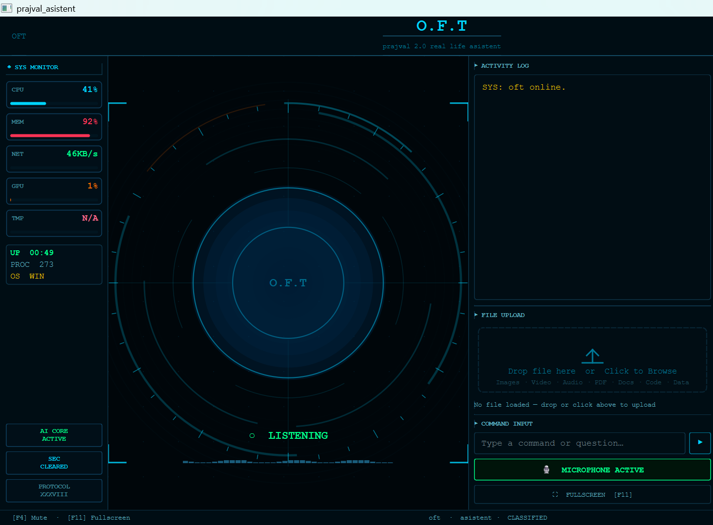
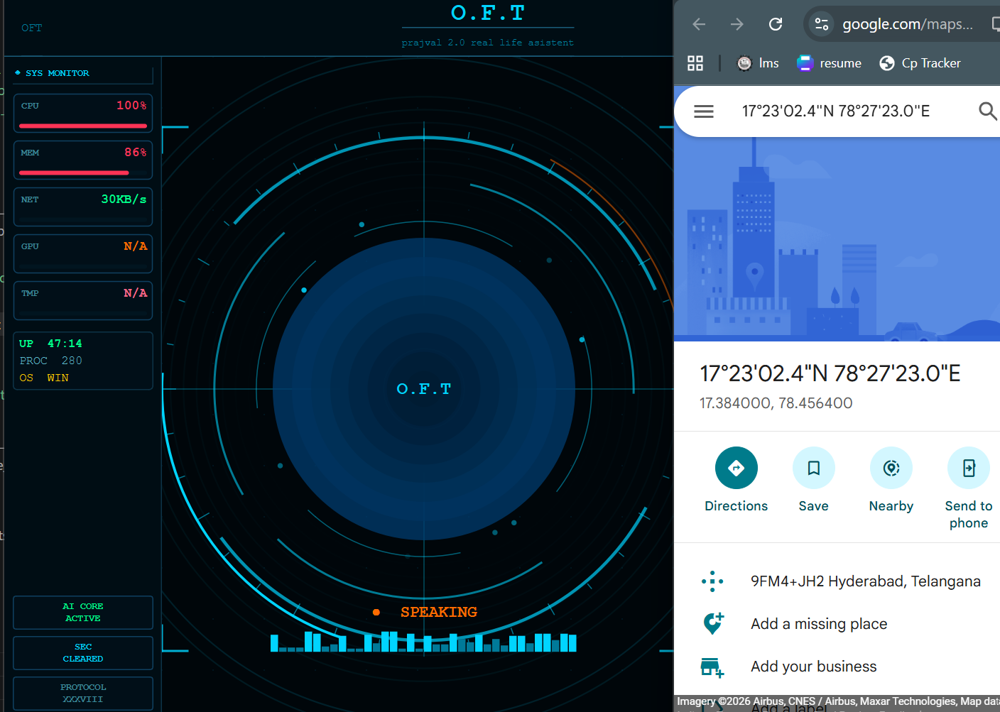

# 🤖 OFT (Open Function Toolkit)

📧 Email: [prajvaloft@gmail.com](mailto:prajvaloft@gmail.com)
🐙 GitHub: github.com/prajvaloft
📸 Instagram: @oft_prajval

### AI Desktop Assistant with Voice, Vision, Memory, and Real-World Computer Control

OFT is an AI-powered desktop assistant built in Python that can listen, speak, see, remember, understand, and perform actions on a computer.

Unlike traditional AI chatbots that only generate text, OFT combines voice interaction, computer vision, memory systems, screen understanding, web intelligence, and desktop automation to interact with the user's digital environment.

The project explores how AI can move beyond conversation and become an active assistant capable of understanding and performing real-world tasks.

---

# 🎥 Demo Video

Watch OFT in action:

🔗 **Demo:https://drive.google.com/file/d/1h83lS-Q01EaHKDbrEOhtCbv7n_BgQH1A/view?usp=drivesdk

## Main Interface



## OFT Assistant Demo



---

# ✨ Overview

OFT combines multiple AI capabilities into a single assistant platform:

* 🎙️ Real-time voice interaction
* 🌍 Multi-language communication
* 👁️ Camera-based object recognition
* 🖥️ Screen understanding and analysis
* 🌐 Web search and information retrieval
* 🧠 Context-aware memory system
* 📂 File and document understanding
* 💻 Computer control and automation
* 🔧 AI-powered tool execution

Instead of simply answering questions, OFT can observe, understand, and perform actions on behalf of the user.

---

# 🌟 What Makes OFT Different?

Most AI assistants focus primarily on text generation.

OFT combines:

### Voice + Vision + Memory + Computer Control

This allows the assistant to:

* Understand spoken instructions
* Analyze screen content
* Recognize objects through a webcam
* Search and retrieve information
* Open applications
* Control desktop operations
* Remember user preferences
* Execute tasks through specialized tools

The project focuses on connecting AI reasoning with practical computer interaction.

---

# 👀 Environmental Awareness

OFT can understand information from multiple sources:

### Camera Vision

* Detects and describes visible objects
* Uses AI-powered image understanding

### Screen Understanding

* Analyzes screenshots
* Reads on-screen content
* Assists with desktop workflows

### File Understanding

* Reads and analyzes documents
* Extracts useful information from files

### Voice Interaction

* Converts speech into actions
* Provides spoken responses

---

# ⚡ Action-Oriented AI

OFT goes beyond answering questions.

It can:

* Open applications
* Launch websites
* Search the internet
* Manage files
* Perform desktop actions
* Assist with development tasks
* Execute automated workflows

---

# 🧠 Memory System

The assistant can store and retrieve:

* User preferences
* Important information
* Conversation context
* Knowledge entries

This helps create a more personalized experience across interactions.

---

# 🏗️ Modular Architecture

OFT follows a modular tool-based architecture.

Every capability is implemented as a separate tool module, making the system easy to extend and maintain.

Examples include:

* Camera Vision
* Browser Control
* Web Search
* Computer Control
* File Processing
* Weather Reports
* News Retrieval
* Maps Integration
* Memory Management

New tools can be added without modifying the assistant core.

---

# 🚀 Features

| Feature                   | Description                                 |
| ------------------------- | ------------------------------------------- |
| 🎙️ Voice Assistant       | Natural voice conversations                 |
| 🌍 Multi-Language Support | Supports multiple languages                 |
| 👁️ Camera Vision         | Object recognition and visual understanding |
| 🖥️ Screen Understanding  | Analyze screenshots and screen content      |
| 🤖 AI Tool Calling        | Automatic tool selection                    |
| 🧠 Memory System          | Context and preference storage              |
| 🌐 Web Search             | Internet information retrieval              |
| 📰 News Updates           | Latest news headlines                       |
| 🌦️ Weather Reports       | Weather information retrieval               |
| 🗺️ Maps Integration      | Location and navigation support             |
| 📂 File Processing        | Document analysis                           |
| 💻 Computer Control       | Desktop automation                          |
| ⌨️ Automation Tools       | Keyboard and mouse actions                  |
| 📚 Knowledge Base         | Custom knowledge storage                    |
| 🔊 Text-to-Speech         | Spoken responses                            |
| 🎤 Speech-to-Text         | Voice command processing                    |

---

# 🏛️ Architecture

```text
User
 │
 ├── Voice Commands
 ├── Camera Input
 ├── Screen Content
 └── Files/Documents
          │
          ▼
        OFT
          │
 ┌────────┼────────┐
 │        │        │
Memory  Vision   AI Brain
 │        │        │
 └────────┼────────┘
          ▼
     Tool Router
          │
 ┌────────┼────────┬────────┐
 │        │        │        │
Browser  Files  System  Web Search
Control         Control
```

# 🛠️ Technologies Used

* Python
* Google Gemini API
* OpenRouter
* OpenCV
* PyQt
* Playwright
* AsyncIO
* JSON-Based Memory System
* Speech Recognition
* Text-to-Speech Systems

---

# ⚡ Quick Start

```bash
git clone https://github.com/prajvaloft/OFT-Assistant.git

cd OFT-Assistant

pip install -r requirements.txt

playwright install

python main.py
```

# 📋 Requirements

| Requirement        | Details       |
| ------------------ | ------------- |
| Operating System   | Windows 10/11 |
| Python             | 3.11+         |
| Microphone         | Required      |
| Webcam             | Optional      |
| Gemini API Key     | Required      |
| OpenRouter API Key | Optional      |

---

# 🎯 Current Capabilities

* Voice conversations
* Multi-language communication
* Camera object recognition
* Screen analysis
* Browser automation
* Desktop automation
* Computer control
* Web searching
* News and weather tools
* Memory management
* File understanding
* Knowledge retrieval

---

# 🔮 Future Improvements

* Android application
* Cross-platform support
* Local AI model integration
* Enhanced memory system
* Multi-agent workflows
* Smart home integration
* Offline operation mode
* Advanced task scheduling

---

# 📜 License

This project is intended for educational, research, and portfolio purposes.

---

# 👨‍💻 Developer

### Prajval Damerla

Building intelligent AI systems that combine voice, vision, memory, and automation to interact with the real world.

📧 [prajvaloft@gmail.com](mailto:prajvaloft@gmail.com)
🐙 GitHub: github.com/prajvaloft
📸 Instagram: @oft_prajval
